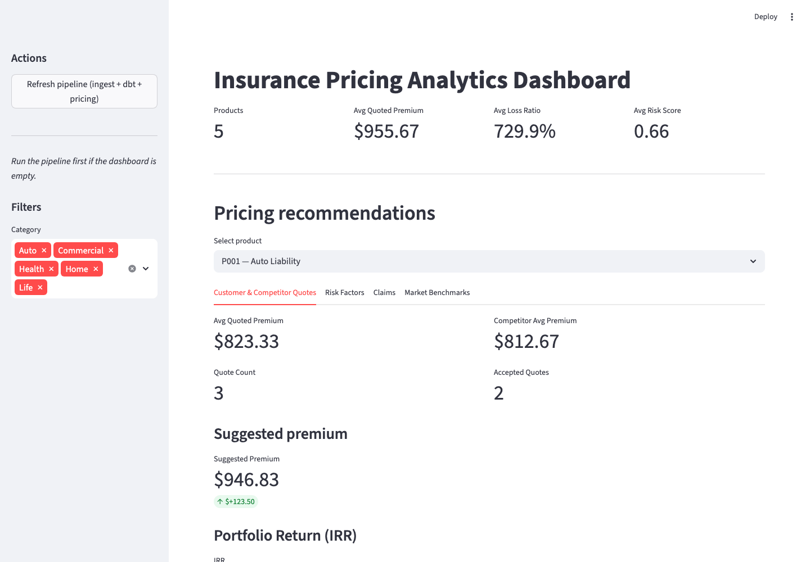

# Pricing Analytics Pipeline

[](https://opensource.org/licenses/MIT)

An insurance pricing analytics workflow that ingests, models, and scores premium-related data — delivering data quality controls and an operational dashboard for underwriting and pricing decision

Built with Python, SQL, DuckDB, dbt, and Streamlit.

## Architecture

1. **Raw sources** in `data/raw/` — customer quotes, competitor quotes, risk factors, claims, historical premiums, market benchmarks, and product catalog.
2. **Ingestion** (`scripts/ingestion.py`) — cleans and writes staging CSVs to `data/processed/`.
3. **dbt models** (`pricing_dbt/`) — staging models (`stg_*`) and a `fct_pricing` fact table joining quotes, competitor benchmarks, risk, and claims onto the product catalog.
4. **Pricing model** (`scripts/pricing_model.py`) — risk- and loss-adjusted premium recommendations.
5. **Portfolio metrics** (`scripts/portfolio_metrics.py`) — IRR (Newton-Raphson) and revenue-shock scenario simulation.
6. **Dashboard** (`streamlit_app.py`) — KPIs, tabbed detail views (quotes, risk, claims, benchmarks), IRR/scenario simulation, and a one-click pipeline refresh.
7. **CI** (`.github/workflows/ci.yml`) — runs the full pipeline (ingest → dbt build → pricing model) end-to-end on every push/PR.

## Dashboard



Additional views: [top](docs/screenshots/dashboard_top.png) · [mid](docs/screenshots/dashboard_mid.png) · [benchmarks tab](docs/screenshots/dashboard_benchmarks_tab.png) · [bottom](docs/screens[...]

## Data Sources

| Source | File | Description |
|---|---|---|
| Customer Quotes | `customer_quotes.csv` | Premium quotes issued to customers |
| Competitor Quotes | `competitor_quotes.csv` | Competitor premium benchmarks |
| Risk Factors | `risk_factors.csv` | Underwriting risk scores |
| Claims | `claims.csv` | Historical claim amounts |
| Historical Premiums | `historical_premiums.csv` | Premium trends by year |
| Market Benchmarks | `market_benchmarks.csv` | Industry average rates |
| Products | `products.csv` | Insurance product catalog |

## How to Run

```bash
python -m venv .venv
source .venv/bin/activate
pip install -r requirements.txt

# Run full pipeline (ingest → dbt → pricing model)
python scripts/run_pipeline.py

# Launch dashboard
streamlit run streamlit_app.py
```

## Pricing Logic

Suggested premium blends:
- **40%** competitor average premium
- **30%** market benchmark
- **30%** latest historical premium

Then applies:
- **Risk adjustment** — ±15% based on average risk score
- **Loss ratio adjustment** — uplift when loss ratio exceeds 60%
- **Guardrails** — clipped to 90–115% of current avg quoted premium

## Tech Stack

Python (pandas), SQL, DuckDB, dbt, Streamlit, GitHub Actions.
